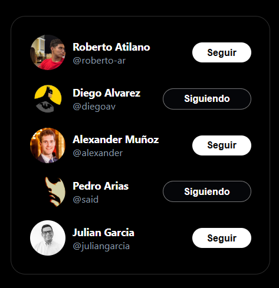

# Follow Card UI – My First React Project

This project is a "Follow Card" UI, inspired by X (formerly Twitter), developed as my first hands-on experience with React and modern frontend development. It showcases my understanding of React components, JSX, state management, and rendering techniques.

## Key Features & Concepts Applied
- ✅ **Component-based architecture** – The UI is structured using reusable React components.
- ✅ **Vite configuration** – The project was bootstrapped with Vite, ensuring fast build times and modern tooling support.
- ✅ **SWC for optimization** – The project leverages SWC (Speedy Web Compiler) for faster transpilation.
- ✅ **React.Fragment & Children** – Used to group elements without adding unnecessary nodes to the DOM.
- ✅ **Dynamic rendering with arrays** – The list of users is stored as an array and injected dynamically into the UI using `.map()`.
- ✅ **Key prop usage** – Ensured optimized rendering by assigning unique keys when mapping through components.
- ✅ **Custom components** – The `FollowCard` component encapsulates the UI and behavior of a follow button similar to X.
- ✅ **Project structure & Root Component** – Implemented a clear folder structure and a well-defined root component for maintainability.

## Tech Stack
- 🔹 **React 18** (Functional Components)
- 🔹 **Vite** (Lightning-fast dev server)
- 🔹 **CSS Modules / Tailwind CSS** (For styling)

This project lays the foundation for more complex React applications by focusing on efficient rendering, modular components, and performance optimization. 🚀

