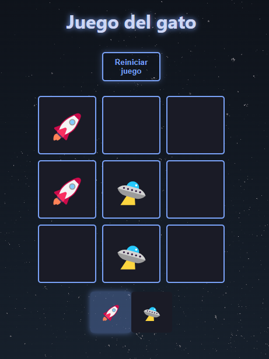

# 🕹️ Tic Tac Toe Game – React Project

This project is a simple implementation of the classic Tic Tac Toe (or "Gato") game using **React**.  
The main focus of this project was to practice and deepen my understanding of the `useState` hook, state management, and the component re-rendering cycle.

## 🚀 What I Learned

- ✅ **useState Hook**: I used `useState` to manage the game board, player turns, and the winner state. This helped me fully understand how state updates trigger re-renders and how React keeps the UI in sync with the state.
- 🔁 **Component Re-rendering**: I observed how React re-renders components when state changes and how important it is to keep the state minimal and predictable.
- 🧠 **Game Logic**: I implemented logic to check for winners, handle draws, and reset the game. It was a great way to apply general programming skills in a React context.
- 🎨 **Conditional Rendering**: Depending on the game state, different UI elements are shown, like the winner screen or the active player.
- 💾 **LocalStorage**: I used `localStorage` to persist the game board state so the game can continue even after refreshing the page.

## 📸 Features

- Two-player gameplay (X and O)
- Clear turn indication
- Winner/draw detection
- Game reset functionality
- Responsive layout
- Space-themed styling 🌌

## 🛠️ Tech Stack

- React
- JavaScript (ES6+)
- CSS (custom styling, no framework)
- LocalStorage API

