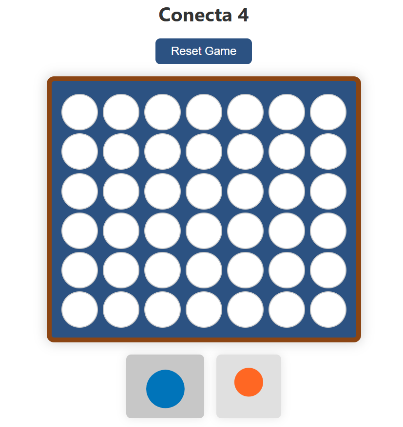

# Connect 4 Game 🎮 (React)


This is a web-based implementation of the classic **Connect 4** game built with **React**. The project was created to practice and strengthen my understanding of React fundamentals, particularly the use of `useState` and `useEffect` hooks.

## 📚 What I Learned

During this project, I focused on:

- **useState**: Managing game state, player turns, and board data.
- **useEffect**: Handling side effects such as checking for a winner after every move.
- Component-based structure and state lifting.
- React event handling and conditional rendering.
- Dynamic rendering of a 2D array (game board).

## 🧠 Features

- Two-player gameplay (Red vs Yellow)
- Interactive grid
- Win detection logic (horizontal, vertical, diagonal)
- Highlighting the winning sequence
- Game reset button
- Basic responsive styling

## 🛠️ Technologies Used

- React (with Hooks)
- JavaScript (ES6+)
- HTML/CSS (Flexbox)
- Vite or Create React App (you can adjust based on what you used)

## 🚀 Getting Started

To run the project locally:

```bash
git clone https://github.com/your-username/connect-4-react.git
cd connect-4-react
npm install
npm run dev
